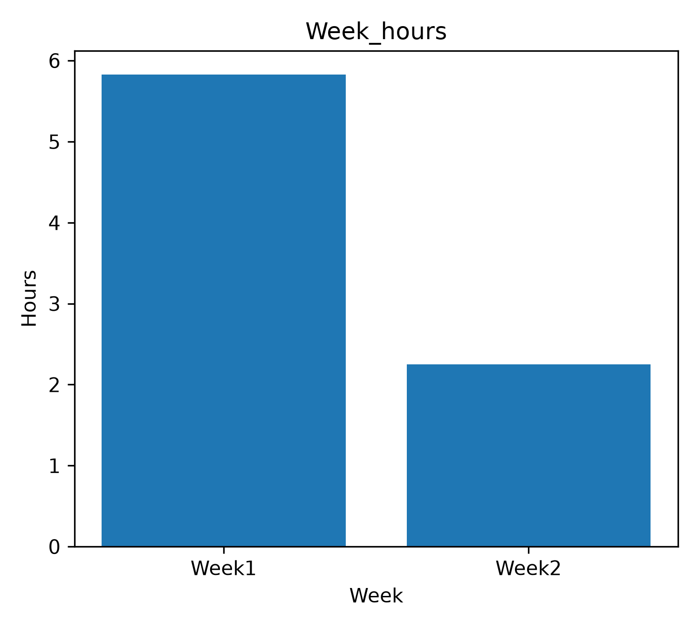
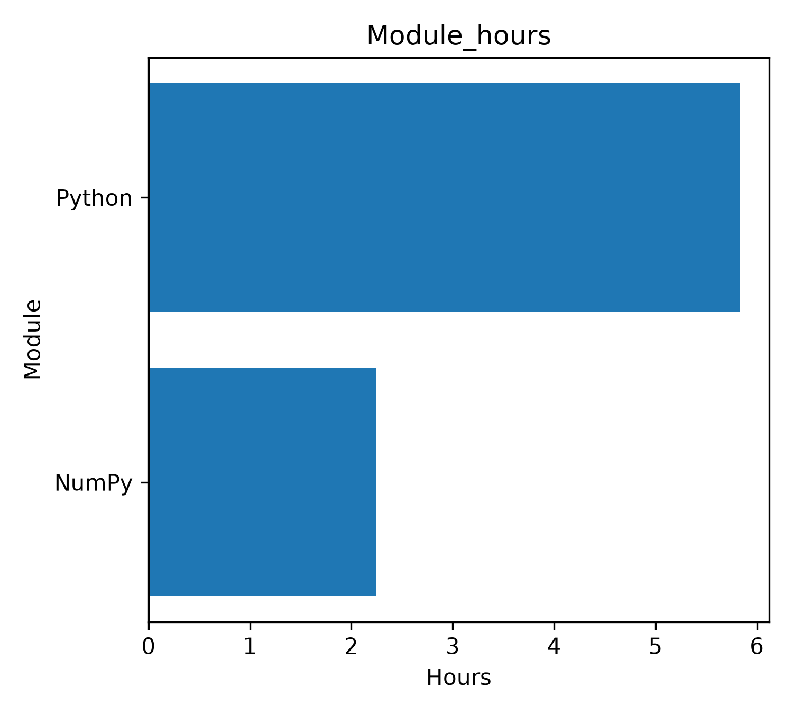
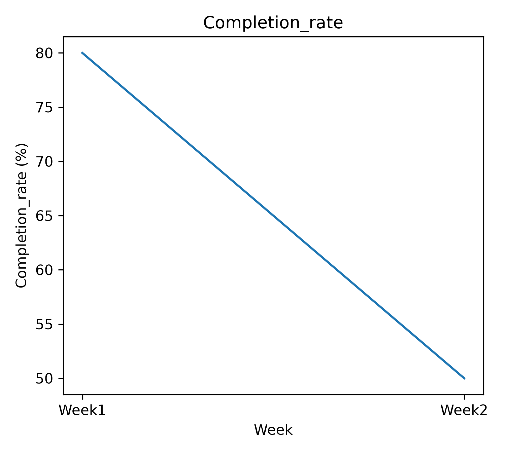
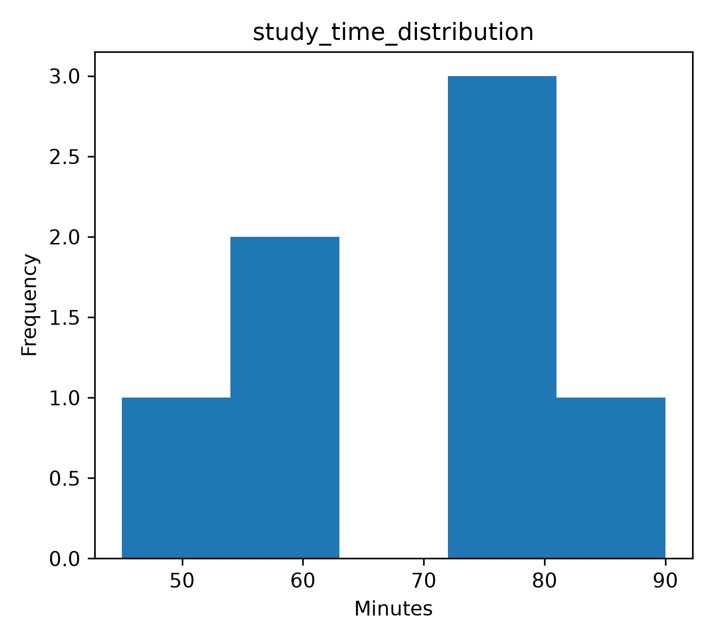

# AI Learning Journey

这是我的 28 周 AI 学习路线，用于系统学习 Python、数据分析、机器学习与 AI 应用开发，并通过每周练习和阶段项目记录学习过程。

当前已完成：

* Week 01：Python Basic
* Week 02：NumPy + Pandas
* Week 03：Matplotlib Data Visualization

---

## 开发环境

* Windows
* Python 3.11.15
* Miniconda
* Conda 环境：`ai-learning`
* VS Code
* Jupyter Notebook
* Git
* GitHub

---

## 学习进度

| Week    | Topic                         | Status      |
| ------- | ----------------------------- | ----------- |
| Week 01 | Python Basic                  | ✅ Completed |
| Week 02 | NumPy + Pandas                | ✅ Completed |
| Week 03 | Matplotlib Data Visualization | ✅ Completed |

---

## Week 01：Python Basic

### 学习内容

* Python 变量和基本数据类型
* 列表
* 字典
* `for` 循环
* `if` 条件判断
* 函数
* txt 文件读取与写入
* Git 本地版本管理
* GitHub 远程仓库推送

### 阶段目标

完成 Python 基础语法练习，并建立基本的 Git / GitHub 项目管理流程。

### 项目文件

* `week01_python_basic.ipynb`
* `outputs/reports/note.txt`
* `outputs/reports/grades.txt`
* `outputs/reports/materials.txt`

---

## Week 02：NumPy + Pandas

### 学习内容

#### NumPy

* NumPy array
* `shape`
* 索引
* 切片

#### Pandas

* DataFrame
* `read_csv()`
* `read_excel()`
* `isna()`
* `dropna()`
* `duplicated()`
* `drop_duplicates()`
* 条件筛选
* `astype()`
* `groupby()`
* `value_counts()`
* `sort_values()`
* `to_excel()`

### 阶段项目

基于学习记录数据完成数据读取、清洗和统计分析。

主要处理内容包括：

* 缺失值检查与处理
* 重复数据处理
* 异常值筛选
* 数据类型转换
* 分组统计
* 类别统计
* 数据排序
* 清洗结果导出

### 数据文件

* `data/raw/study_log.csv`
* `data/processed/cleaned_study_log.xlsx`
* `data/processed/valid_study_log.xlsx`

### 项目文件

* `week02_numpy_pandas.ipynb`

### Week 02 工作流

```text
Raw Data
   ↓
Pandas
   ↓
Missing Value Processing
   ↓
Duplicate Processing
   ↓
Data Filtering
   ↓
Data Type Conversion
   ↓
Groupby / Value Counts
   ↓
Processed Data
```

---

## Week 03：Matplotlib Data Visualization

### 学习内容

* `plt.figure()`
* `plt.bar()`
* `plt.barh()`
* `plt.plot()`
* `plt.hist()`
* `plt.xlabel()`
* `plt.ylabel()`
* `plt.title()`
* `plt.tight_layout()`
* `plt.savefig()`

同时继续使用 Pandas 完成绘图前的数据准备，包括：

* `groupby()`
* `sum()`
* `mean()`
* `astype(str)`
* 数值单位转换
* 百分比计算
* 数据统计与结果检查

### 阶段目标

将 Week 02 清洗后的学习记录继续用于数据可视化，形成：

```text
Data Reading
   ↓
Data Cleaning
   ↓
Data Analysis
   ↓
Data Visualization
   ↓
PNG Output
   ↓
GitHub README
```

---

### Weekly Study Hours

使用 `week` 对学习记录进行分组，将 `duration_minutes` 汇总后转换为小时，并使用柱状图比较不同周的总学习时长。



该图用于比较不同学习周之间的总学习时间。

---

### Study Hours by Module

使用 `module` 对学习记录进行分组，计算不同学习模块的总学习时长，并使用横向柱状图进行比较。



该图用于比较 Python、NumPy、Pandas、Matplotlib 等不同学习模块的时间投入。

---

### Weekly Task Completion Rate

根据 `completed` 字段中的 `True / False` 数据，按周计算任务完成率，并使用折线图观察完成率随学习周数的变化。



该图用于观察任务完成率随时间的变化趋势。

---

### Study Duration Distribution

使用 `duration_minutes` 绘制学习时长分布直方图，用于观察单次学习时间主要集中在哪些区间。



当前数据量较少，因此使用较少的 `bins` 观察整体分布，避免区间划分过细产生大量空区间。

---

### Week 03 项目文件

* `week03_matplotlib_visualization.ipynb`
* `outputs/figures/week_hours.png`
* `outputs/figures/module_hours.png`
* `outputs/figures/completion_rate.png`
* `outputs/figures/study_time_distribution.png`

### Week 03 工作流

```text
valid_study_log.xlsx
        ↓
     Pandas
        ↓
groupby / mean / sum
        ↓
Data Preparation
        ↓
    Matplotlib
        ↓
bar / barh / plot / hist
        ↓
   plt.savefig()
        ↓
    PNG Figures
        ↓
   GitHub README
```

---

## 当前项目结构

```text
python basic/
│
├─ .vscode/
│
├─ data/
│  ├─ raw/
│  │  └─ study_log.csv
│  │
│  └─ processed/
│     ├─ cleaned_study_log.xlsx
│     └─ valid_study_log.xlsx
│
├─ outputs/
│  ├─ figures/
│  │  ├─ week_hours.png
│  │  ├─ module_hours.png
│  │  ├─ completion_rate.png
│  │  └─ study_time_distribution.png
│  │
│  └─ reports/
│
├─ week01_python_basic.ipynb
├─ week02_numpy_pandas.ipynb
├─ week03_matplotlib_visualization.ipynb
├─ environment.yml
├─ .gitignore
└─ README.md
```

---

## 恢复运行环境

在安装了 Miniconda 的电脑上，可以使用项目中的 `environment.yml` 创建 Conda 环境：

```bash
conda env create -f environment.yml
```

激活环境：

```bash
conda activate ai-learning
```

然后在 VS Code 或 Jupyter Notebook 中运行对应的 `.ipynb` 文件。

---

## 前三周学习总结

通过前三周的学习，目前已经完成了一条基础的数据分析工作流：

```text
Python Basic
      ↓
NumPy + Pandas
      ↓
Data Cleaning
      ↓
Data Analysis
      ↓
Matplotlib
      ↓
Data Visualization
      ↓
Git / GitHub
```

Week 01 主要建立 Python 编程基础和 Git 工作流。

Week 02 开始使用 NumPy 和 Pandas 进行真实数据读取、清洗和统计。

Week 03 在 Week 02 数据基础上继续完成可视化，将数据分析结果转换为柱状图、横向柱状图、折线图和直方图，并保存为 PNG 用于 GitHub 项目展示。

后续将继续在这一基础上逐步进入更完整的数据分析、机器学习和 AI 应用开发。
