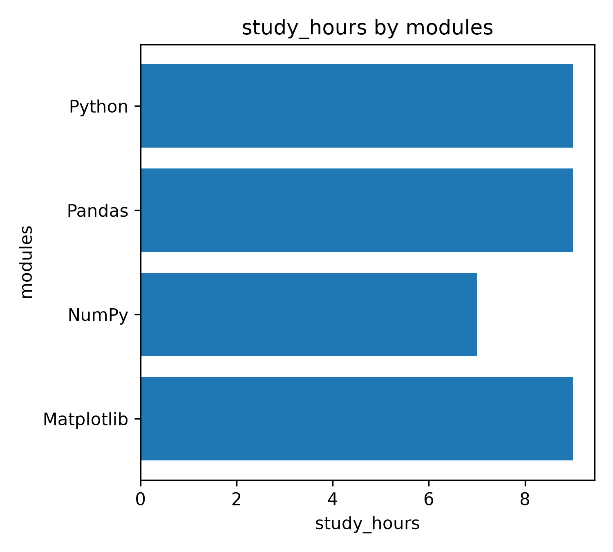

# AI Learning Journey

这是我的 28 周 AI 学习路线，用于学习 Python、数据分析、机器学习与 AI 应用开发，并通过阶段项目记录学习过程。

## 开发环境

- Windows
- Python 3.11.15
- Conda 环境：ai-learning
- VS Code
- Jupyter Notebook
- Git
- GitHub

## Week 01：Python Basic

学习内容：

- Python 变量和基本数据类型
- 列表
- 字典
- for 循环
- if 条件判断
- 函数
- txt 文件读取与写入
- Git 本地版本管理
- GitHub 远程仓库推送

## Week 02：NumPy + Pandas

学习内容：

- NumPy array
- Pandas DataFrame
- CSV / Excel 数据读取
- 缺失值处理
- 重复值处理
- 条件筛选
- groupby
- value_counts
- sort_values
- Excel 导出

## Week 03：Matplotlib Data Visualization

学习内容：

- `plt.figure()`
- `plt.bar()`
- `plt.barh()`
- `plt.plot()`
- `plt.hist()`
- `plt.xlabel()`
- `plt.ylabel()`
- `plt.title()`
- `plt.tight_layout()`
- `plt.savefig()`

### Study hours by module

The chart compares the total study hours spent on different learning modules.